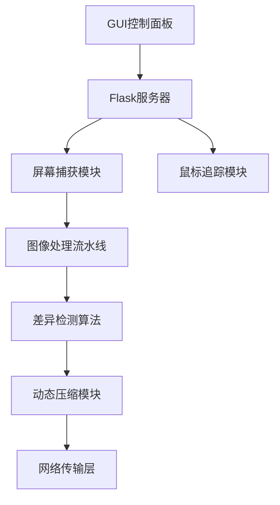

# PixelStreamer - 实时屏幕流媒体解决方案


## 项目概述

PixelStreamer 是一个高效实时的屏幕流媒体解决方案，提供以下核心功能：


- 🖥️ 实时屏幕画面传输（支持动态帧率调整）
- 🎮 鼠标位置同步与可视化
- 📸 一键截图功能
- 🔄 动态画面差异检测与压缩
- 🚀 自适应图像质量调整
- 🖱️ 流畅的鼠标移动预测算法

## 主要特性
### ---项目主要用于PPT展示，Web投屏多平台兼容---

### 智能画面传输
```python
# 使用动态差异检测算法
prev_gray = cv2.cvtColor(previous_frame, cv2.COLOR_BGR2GRAY)
curr_gray = cv2.cvtColor(current_frame, cv2.COLOR_BGR2GRAY)
diff = cv2.absdiff(prev_gray, curr_gray)
_, threshold_diff = cv2.threshold(diff, 25, 255, cv2.THRESH_BINARY)
```

### 性能优化
- 动态调整JPEG压缩质量（70%-10%）
- 网络带宽优化（平均500Kbps-1.5Mbps）
- 多线程架构（GUI与服务器分离）

## 安装指南

### 依赖要求
```bash
pip install -r requirements.txt
```

`requirements.txt` 内容：
```
flask>=2.0.3
opencv-python>=4.5.5
pyautogui>=0.9.53
mss>=6.1.0
numpy>=1.21.5
```

### 系统要求
- Windows/macOS/Linux
- Python 3.7+
- 支持OpenGL加速的显卡

## 使用说明

### 启动应用
```python
python main.py
```

### 访问方式
1. 启动后自动打开控制面板
2. 点击"启动服务"按钮
3. 使用浏览器访问：
   ```http
   http://[服务器IP]
   ```

### 控制面板功能
- 服务状态指示（运行/停止）
- 实时IP地址显示
- 一键启动/停止服务
- GitHub仓库链接

## 高级配置

在代码中可调整以下参数：
```python
REFRESH_INTERVAL = 0.25       # 基础刷新间隔（秒）
CHANGE_THRESHOLD = 500        # 画面变化阈值
QUALITY_LEVELS = {
    'high': 70,               # 默认质量
    'medium': 50,             # 中等负载质量
    'low': 10                 # 高负载质量
}
```

## 技术架构



## 贡献指南

欢迎通过GitHub提交：
1. Fork项目仓库
2. 创建特性分支（`git checkout -b feature`）
3. 提交修改（`git commit -m '新增功能'`）
4. 推送分支（`git push origin feature`）
5. 提交Pull Request

## 许可协议

本项目采用 [MIT License](LICENSE)

---

> **提示**：首次运行时可能需要允许防火墙权限。建议在局域网环境中使用以获得最佳性能。
